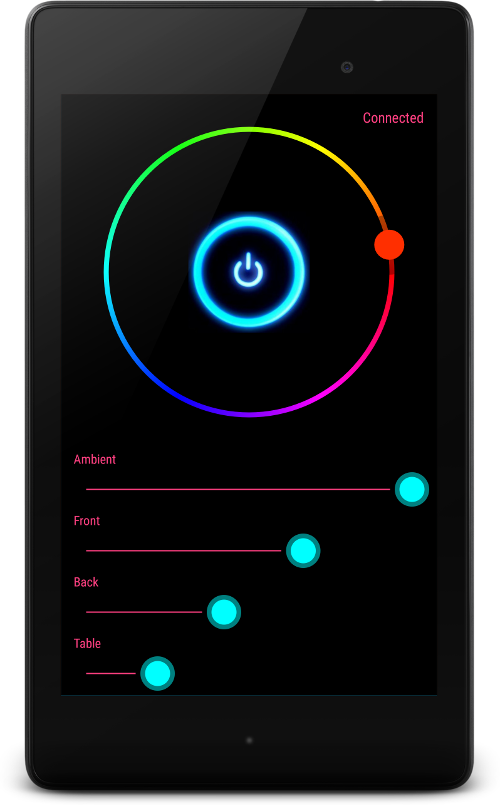
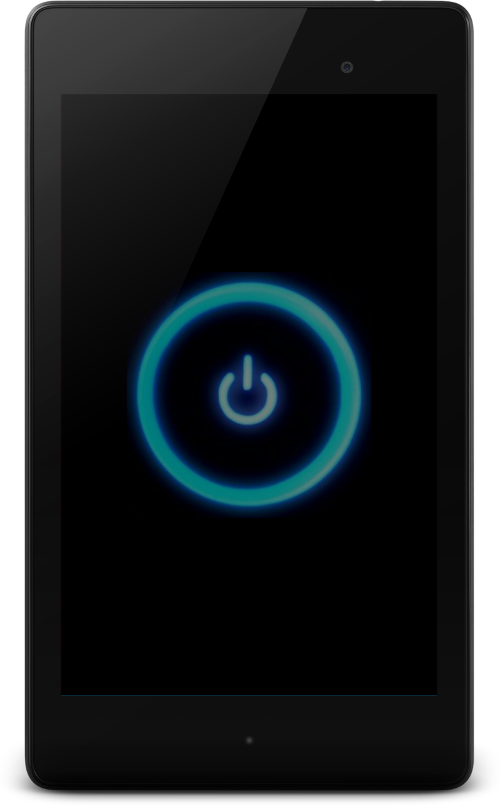

# What is it ?

It is an example application for controling dedicated OCF device.

# Screenshots
## Master switch in ON state


## Master switch in OFF state


# Dependecies

```
https://github.com/pwiklowski/libocf-android
```
Make sure that libocf library location is configured in settings.gradle and  build.gradle:


#License
MIT